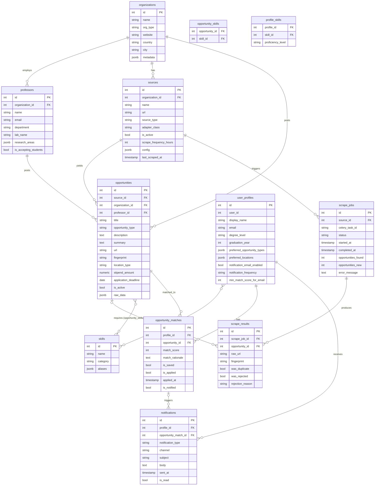

# Backend

FastAPI application following clean architecture. Dependencies point inward: infrastructure
knows about domain; domain knows nothing about infrastructure.

## Layer Map

```
app/
├── core/          Cross-cutting: config (Pydantic Settings), structured logging
├── domain/        Pure Python — zero framework imports
│   ├── enums.py   All StrEnums: OpportunityType, SourceType, ScrapeStatus, ...
│   ├── entities/  Core data structures (dataclasses)
│   ├── ports/     Interfaces (Protocols): repos, LLM, notifier, scraper
│   └── value_objects/  Immutable typed wrappers (Fingerprint, Location, Money)
├── application/   Use cases — orchestration only, no infrastructure details
│   ├── services/  OpportunityService, MatchingService, DedupService, ...
│   └── dto/       Input/output data shapes for use cases
├── tools/         Agent-ready: thin callable wrappers over services (Tool protocol)
├── agents/        Future autonomous agents (scaffolded, not yet implemented)
├── infrastructure/  Adapters — implement domain/ports
│   ├── db/        SQLAlchemy models, session factory, repositories
│   ├── scrapers/  Playwright + BeautifulSoup source adapters
│   ├── llm/       OpenAI / Anthropic provider adapters
│   ├── notifications/  SMTP / SendGrid email adapters
│   └── cache/     Redis client helpers
├── api/           FastAPI routers and Pydantic request/response schemas
└── workers/       Celery app, beat schedule, task definitions
```

## Entity Relationship Diagram



## Key Design Decisions

| Decision | Reason |
|---|---|
| `fingerprint` unique constraint on `opportunities` | Deterministic dedup — same posting scraped twice creates zero duplicates |
| `raw_data JSONB` on `opportunities` | Never lose raw scrape payload; re-parse without re-scraping |
| `summary TEXT` on `opportunities` | AI-generated summary cached in DB; no repeat LLM calls |
| `user_id` on `user_profiles` | Single user now (always 1); multi-user is a FK + auth change, not a schema rewrite |
| `is_accepting_students` on `professors` | Feeds ProfessorSuggesterAgent; null = "not yet scraped" |
| `metadata JSONB` on several tables | Flexible per-source extra fields without schema churn |
| `ScrapeResult` per posting per job | Full audit trail: dedup rate, rejection rate, ingestion success per run |
| String columns for enum values | Avoids `ALTER TYPE` in PostgreSQL when adding new enum variants |

## Extension Points

- **New opportunity source**: add a class in `infrastructure/scrapers/sources/` implementing `SourceAdapter`, register in `infrastructure/scrapers/registry.py`.
- **New LLM provider**: add a class in `infrastructure/llm/` implementing `LLMPort`.
- **New notification channel**: add a class in `infrastructure/notifications/` implementing `NotifierPort`.
- **New agent**: add a class in `agents/` implementing `Agent`, expose via a Celery task.
- **Multi-user**: add a `users` table, remove `default_user_id=1`, wire auth middleware.

## Running

```bash
make up             # start all services
make migrate        # apply migrations
make seed           # seed default user + example sources
make test           # full test suite
make shell-api      # bash into API container
```
